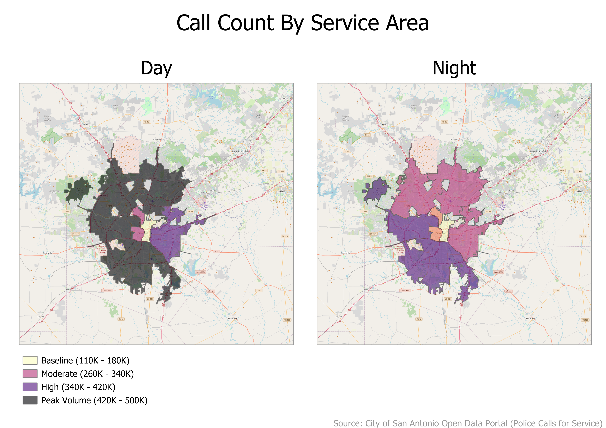
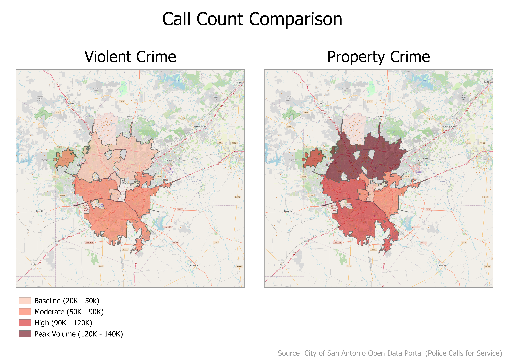
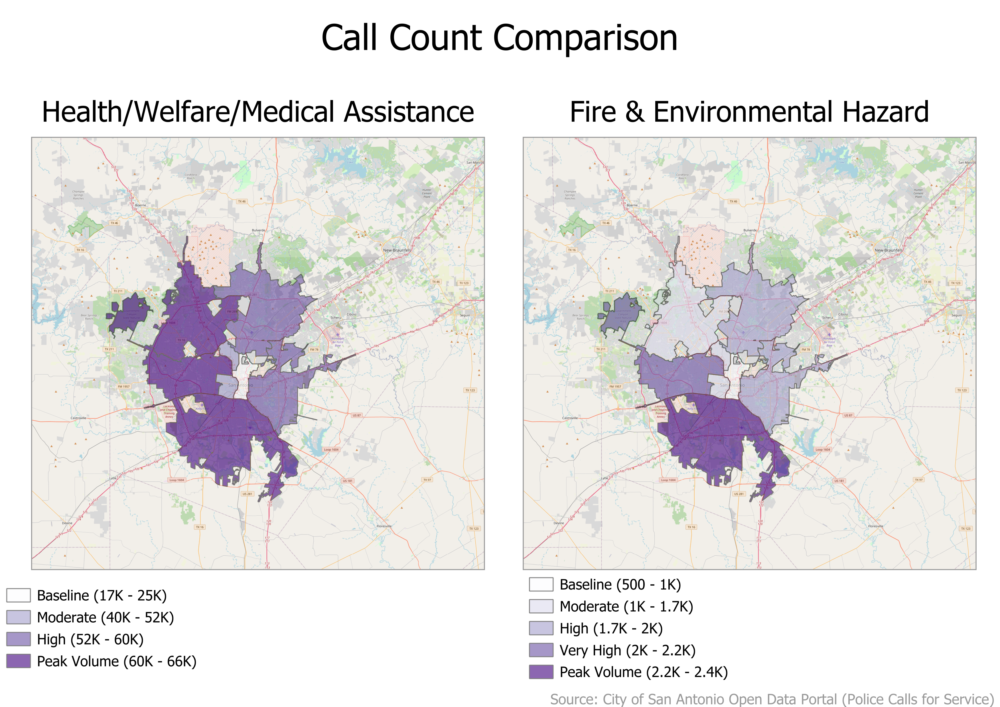
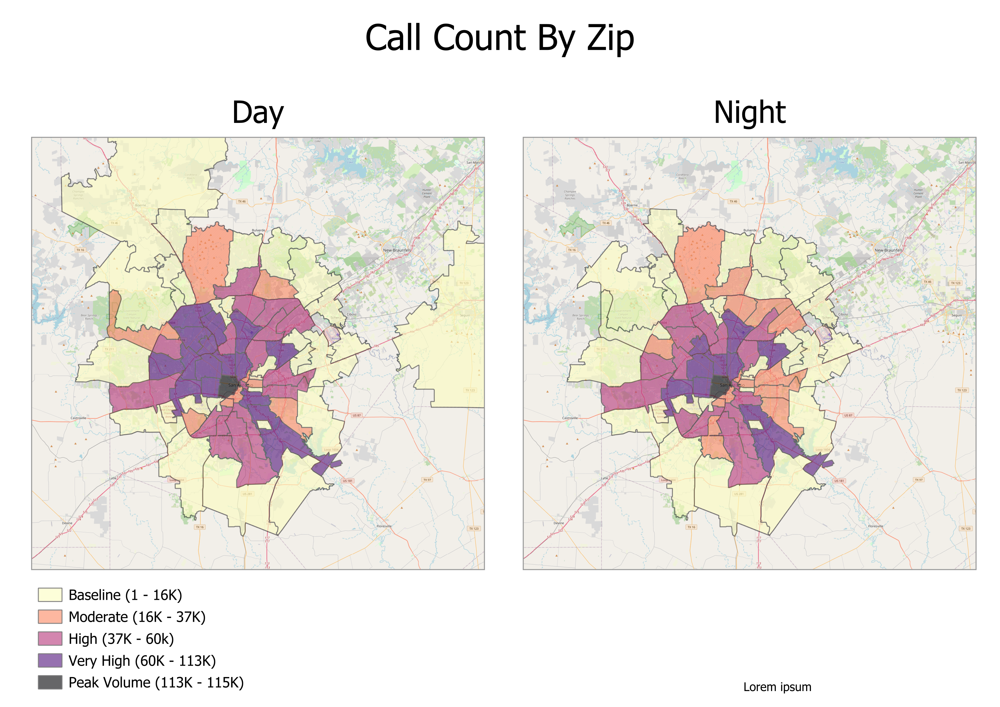
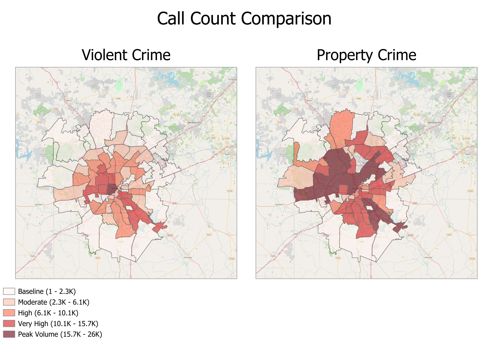
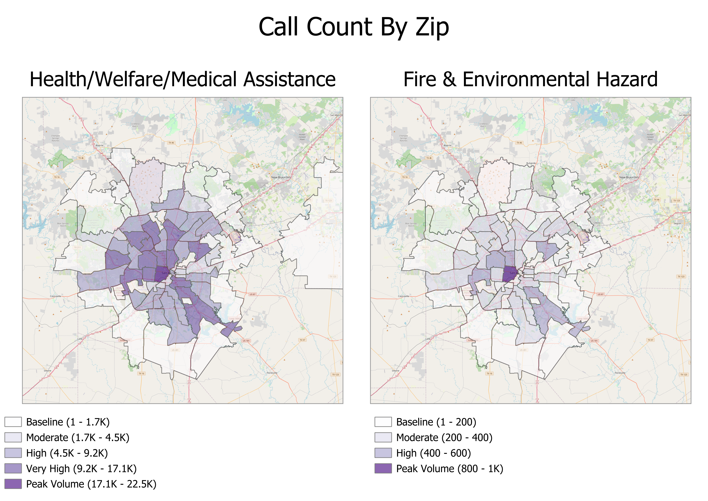

# san-antonio-police-calls-analysis
End-to-end GIS analysis of 5.2 million police service calls using Python and QGIS
# San Antonio Public Safety: Spatial Analysis of 5.2M Service Calls

## Project Overview
An MIS-focused analysis exploring the distribution of police service calls across San Antonio. This project bridges the gap between massive raw datasets and actionable geographic insights.

## Key Technologies
* **Python (Pandas, NumPy):** Data engineering and cleaning of 5.2 million records.
* **QGIS:** Spatial joins, zip-code aggregation, and cartographic design.
* **Data Source:** [San Antonio Open Data Portal](https://data.sanantonio.gov/)

## Methodology
1. **Cleaning:** Handled null values and categorized 911 codes into 6 priority groups.
2. **Feature Engineering:** Extracted timestamps to compare Day vs. Night trends.
3. **Visualization:** Developed 5-class manual legends to ensure accurate comparisons of high-volume medical calls vs. lower-volume fire hazards.

## Results

## Analysis by Service Area

### 1. Day vs. Night Call Volume (Service Area)

This comparison highlights the significant shift in resource demand, with peak volumes reaching 500k during daylight hours.

---

### 2. Crime Category Comparison

Detailed breakdown of Violent Crime vs. Property Crime hotspots.

---

### 3. Health & Fire Hazard Distribution

Analysis of medical assistance calls versus environmental hazards.

## Analysis by ZIP code

### 1. Day vs. Night Call Volume (Service Area)

This comparison highlights the significant shift in resource demand, with peak volumes reaching 500k during daylight hours.

---

### 2. Crime Category Comparison

Detailed breakdown of Violent Crime vs. Property Crime hotspots.

---

### 3. Health & Fire Hazard Distribution

Analysis of medical assistance calls versus environmental hazards.
